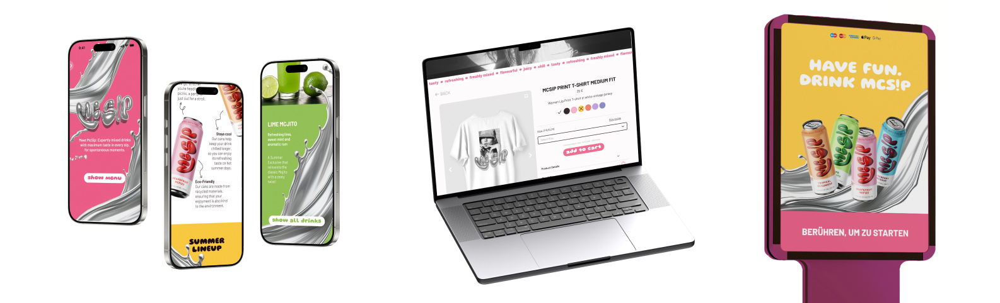
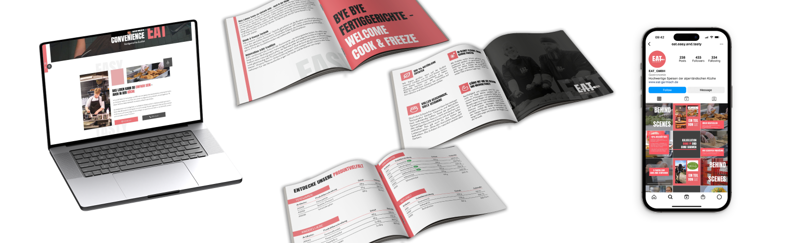

# KatharinaBrandtner.github.io

# README.md for My Portfolio

## About Me

Hello! ✨ I am Katharina Brandtner, a Munich-based Computer Science & Design student crafting user-centered digital experiences. I will graduate in June 2027.

## Projects

Here are some of my works:

- **[Ambulance Waiting Concept](project_ambulance.html)**  
    
  University project for ambulance-system.

- **[Rebrand McDonald's / Mc Sip](project_mcsip.html)**  
    
  University rebranding project for mcdonsals.

- **[Ferienwohnungen Franz Brandtner](project_fewo.html)**  
    
  Website for holiday accommodations.

- **[Eat - Easy and Tasty](project_eat.html)**  
    
  Corporate identity for a convenience food company.

For more of my work, please visit [this page](all_projects.html).

## Key Skills

- **UX/UI Design**
- **Web Development**
- **User  Research**
- **Prototyping**

## Contact

## Contact

If you want to learn more about me or get in touch, you can visit my [About Me page](about_me.html) or just text me via [LinkedIn](https://www.linkedin.com/in/katharina-brandtner-1548b4311/) 

---

I look forward to hearing from you! 🎀